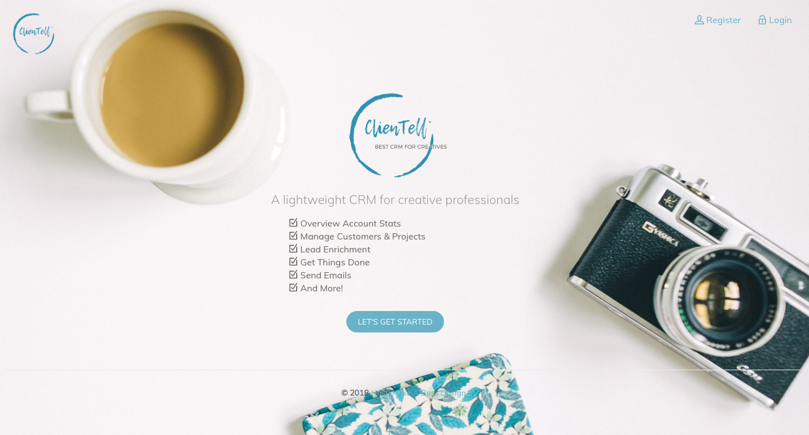

# ClienTell

A CRM for creative professionals, built with Java, Spring Boot, Hibernate and Thymeleaf

- Worked with Spring Data JPA and Hibernate to allow uses to manage customers and projects;
- Implemented user authentication with Spring Security;
- Utilized Jsoup, RestFB and Facebook API to automatically enrich customer profiles;
- Created real-time account data visualization using JavaScript and MySQL.
